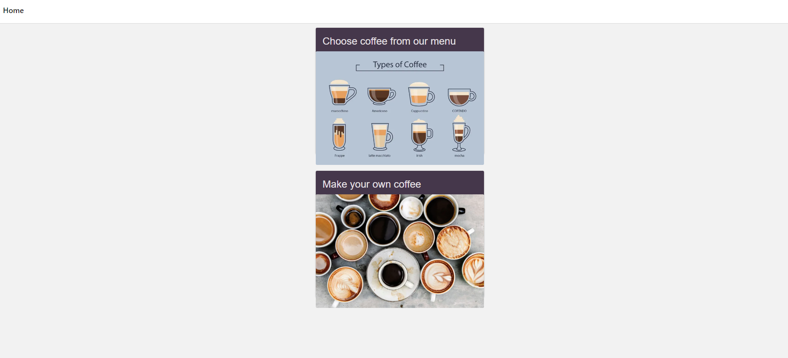

# Coffee Shop
Web application for a Coffee Shop that will enable the users to pre-order their preferred 
type of coffee.

## Project Structure
Coffee Shop is a react native application for web. 
This project is not production ready, it should serve for the technical interview.
- **Pages** (_Home Page, Menu Page, Configurator Page_): They represent the main screens that the user can navigate between, using the navigation library. They consist of reusable components.
- **Components** (_Coffee List, Coffee Details, Confirmation Modal_): They should be used inside pages or other components and they are broken down as such so they can be reused in multiple places. As requested, they communicate between each other in pub/sub manner using the event bus, instead of store.
- **Mock API**: This is used for loading data that is stored in _data-store.ts_ file.
- **Models**: In this folder we are having _interface_, _class_ that implements the interface and _enums_.
- **Tests**: Few unit tests are provided for the components using Jest.

## Prerequisites
Node v20.11.1

## Installation
Instructions on how to install and set up the project locally. 

```bash
# Install dependencies
npm install

# Start the application
npm run web

# Use to run tests
npm run test

```
Once the server is running, you can access the application by navigating to http://localhost:8081 in your web browser.

## Libraries
- React Native
- react-native-paper (Library that implements Material Design) 
- react-navigation/native (Library for navigating between different screens/pages)
- axios-mock-adapter (Used for mocking axios requests to external API)
- testing-library/react-native
- Jest
- Event Bus (Simple custom implementation for pub/sub communication between components)


## Screenshot



